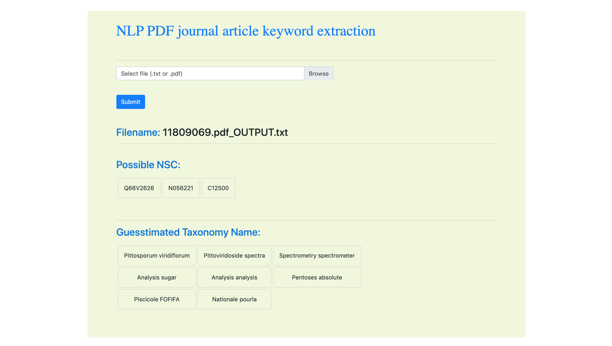

# NLP web-app to parse PDF journal articles

This small flask application demonstrates use of NLTK to extract keywords (such as unique NSC identifiers and taxonomy related words) from PDF journal articles and render on the web-page for easy interpretation.

#### Installation
After installing all dependencies, run the app by entering its folder and typing:

`$ python app.py`
> Another option is to run using gunicorn:
`gunicorn -c gunicorn-config app:app`

The file could be a `.txt` or `.pdf` file. There will be two outputs, each in their own small `HTML` table:
1. Possible NSC numbers that relate to the natural product extract (compound)
2. Possible taxonomy names that were found in the corpus

Screenshot of the web-app:

